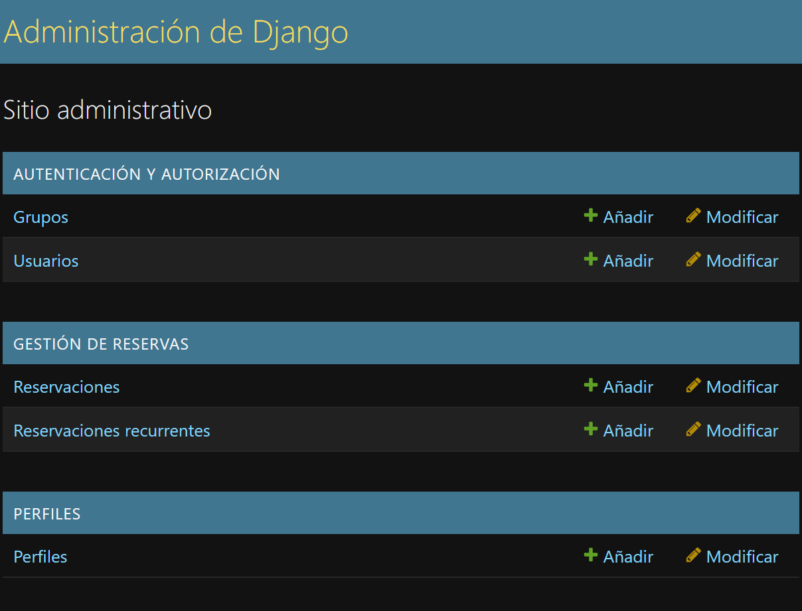
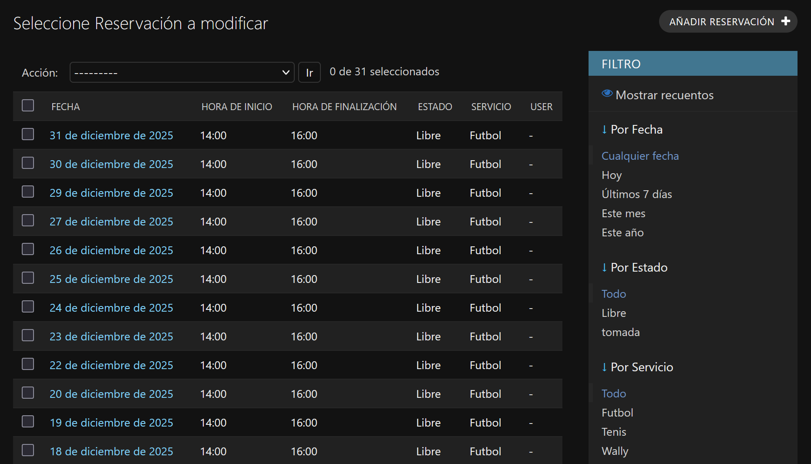
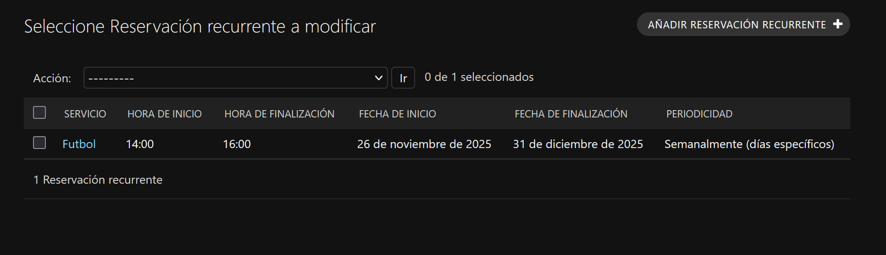
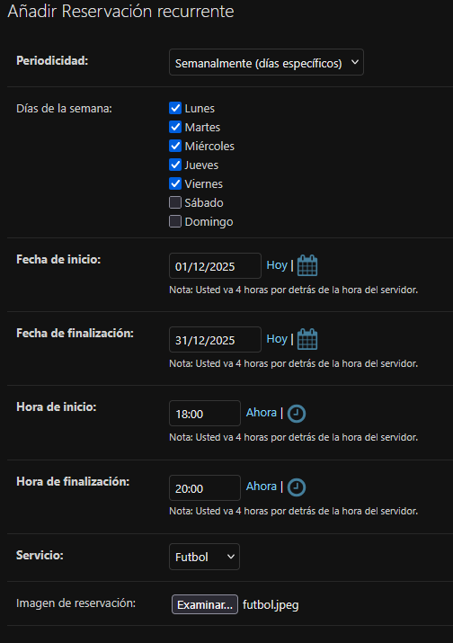
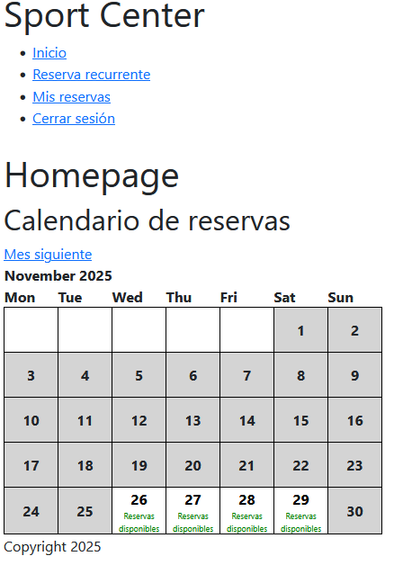
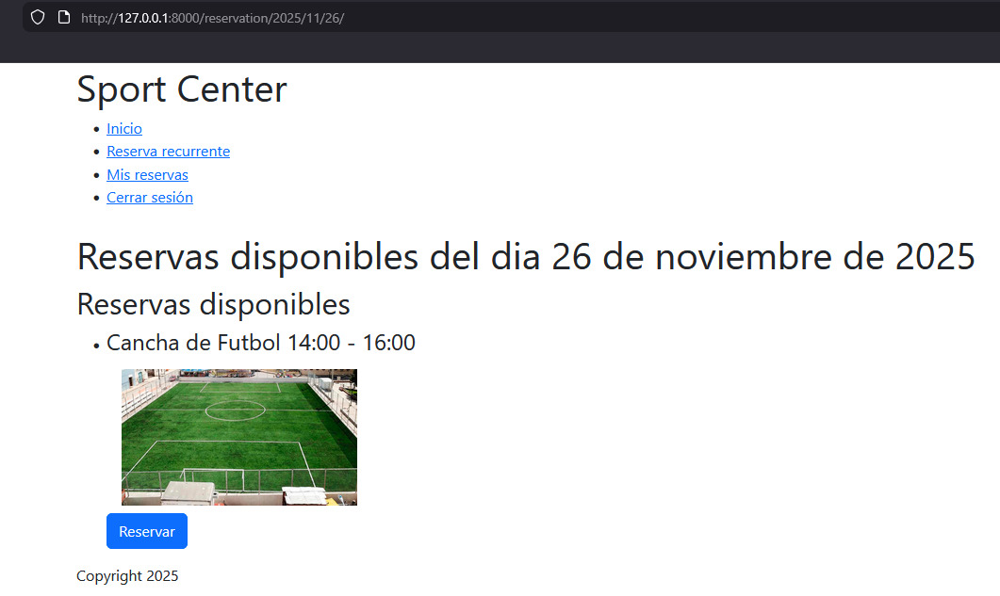
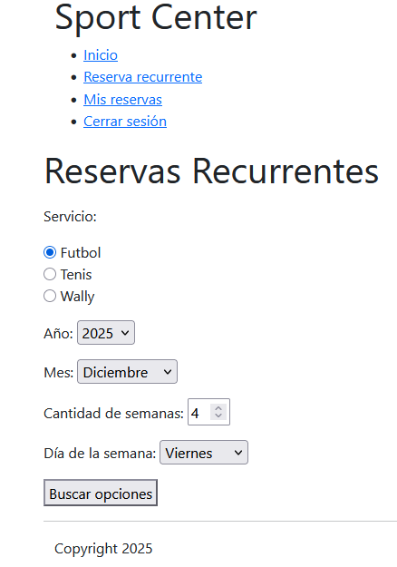
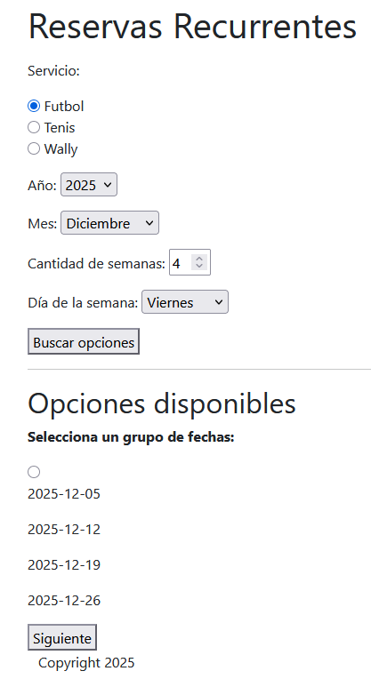
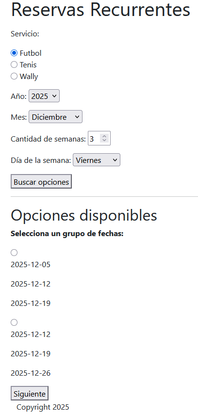
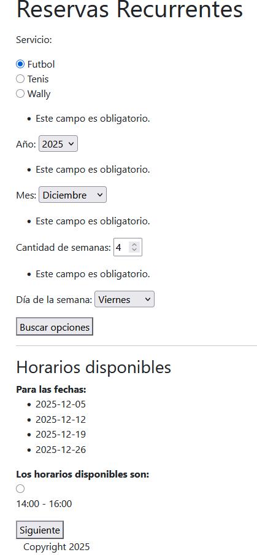

# Proyecto de gestor de reservas

## índice:

* [Índice](#índice)
* [Contraseñas y usuarios ya integrados](#contraseñas-y-usuarios-ya-integrados)
* [Instrucciones](#instrucciones)
    * [Como gestionar reservas como administrador](#como-gestionar-reservas-como-administrador)
    * [Como usar la aplicación como usuario](#como-usar-la-aplicación-como-usuario)

## Contraseñas y usuarios ya integrados:
Estos usuarios son los ya integrados en la base de datos para realizar pruebas sin tener que crear nuevos.

* Admin (superuser):
    * Username: admin
    * Contraseña: 12345678
* Usuario:
    * Username: usuario1@email.com
    * Contraseña: 12345678
* Usuario:
    * Username: usuario2@email.com
    * Contraseña: 12345678   

Este proyecto es de una aplicación para reservar canchas de futbol, wally o tenis en diferentes turnos definidos por una fecha y horario específico. 

El funcionamiento basico de esta aplicación es la siguiente:

### 1. funciones de administrador:
* Creación, edición y eliminación de reservas.
* Creación, edición y eliminación de usuarios.

### 2. funciones de usuario:
* Tomar reservas disponibles.
* Cancelar reservas disponibles.

## Instrucciones:

### Como gestionar reservas como administrador:
Desde la página de administrador se pueden gestionar las reservas en el apartado de "Gestión de reservas". Solo las reservas que se creen desde el administrador van a aparecer para los usuarios en el calendario de reservas.

#### Gestionar reservas individuales:
Para gestionar reservas individuales hay que clickar en "Reservaciones", aquí saldrá una lista de las reservas existentes. Para crear una nueva reserva hay que dar click en "Añadir reservación" arriba a la derecha. 

Para crear una reserva individual se debe poner la fecha de la reserva, la hora de inicio, la hora de finalización y una imagen de la reserva.

El estado debe quedar como "Libre" y el usuario debe quedar vacio para que esta reserva quede como una reserva disponible para los usuarios. Si se pone el estado como "tomada" y se selecciona un usuario, esta reserva se creará como una reserva para ese usuario.

#### Gestionar reservas recurrentes:
En este apartado se pueden crear varias reservas a la vez para no tener que crear las reservas una por una. Para gestionar las reservas recurrentes hay que clickar a "Reservaciones recurrentes". En el menú de reservas recurrentes nos aparecerá una lista de las reservas recurrentes que creamos, para crear una nueva, hay que clickar a "Añadir reservación recurrente" arriba a la derecha.

Para crear reservas recurrentes se debe escoger:
* La fecha de inicio y la fecha final que establece el rango de fechas en la que se van ha crear las reservas.
* La periodicidad de creación de las reservas. Las opciones son: 
    * Diariamente: Esta opción es para crear esa reserva todos los dias del rango de fechas.
    * Semanalmente: Esta opción es para crear reservas en los dias específicos que escojas de la semana. Esta opción te permite crear reservas todos los sabados de las semanas que están en el rango de fechas por ejemplo.
* Hora de inicio y final de las reservas que se van a crear (de 18:00 a 20:00 por ejemplo).
* El servicio de esta reserva. En este caso Futbol, Walley o Tenis.
* Imagen de reservación que es una imagen del servicio.

Al crear reservas recurrentes, se crean las reservas individuales correspondientes. Por ejemplo, si se crean reservas diarias de la fecha 1/12/2025 a 7/12/2025, se van a crear 7 reservas individuales con las caracteristicas señaladas. 

Despues de crear reservas recurrentes, aparecerá un item de reservas recurrentes en la lista de reservas recurrentes, este item se puede editar al darle click y los cambios que se hagan se realizan a todas las reservas individuales pertenecientes. También, al eliminar el item de reservas recurrentes, se eliminan todas las reservas que corresponden.

### Como usar la aplicación como usuario:
#### Página de inicio:
En la página de inicio hay un calendario de reservas en la que se señalan los dias con reservas disponibles. Para hacer reservas simples puedes clickar en cualquier dia que tenga reservas disponibles y te llevará a una pagina de las reservas de ese dia en la que te muestran las reservas de ese dia.

#### Reservas recurrentes:
Esta pagina permite al usuario realizar reservas recurrentes para un mes y servicio escogido. En esta página se escoge el servicio, el mes, el año, el número de semanas que se 
desea reservar en ese mes y el dia de la semana.

Despues de escoger estas opciones, clickamos en "Buscar opciones" y aparecen los grupos de fechas que estan disponibles para las opciones que se escogieron. Por ejemplo, si yo escojo las opciones:
* Servicio: Futbol
* Año: 2025
* Mes: Diciembre
* Nro de semanas: 4
* Dia: Viernes

Asumiendo que hay reservas disponibles todos los viernes, saldra esta opción:

- [ ]  2025-12-05 2025-12-12 2025-12-19 2025-12-26

Osea los 4 viernes del mes de diciembre 2025.

Si escogemos 3 semanas con las demas opciones iguales, saldran 2 opciones porque las opciones son los primeros 3 viernes de mes y los 3 ultimos viernes:
- [ ]  2025-12-05 2025-12-12 2025-12-19 2025-12-26
- [ ]  2025-12-12 2025-12-19 2025-12-16 2025-12-26

Entonces después escogemos ela opción y clickamos a "Siguiente".

Entonces salen las horas disponibles para el grupo de fechas seleccionado. Las horas que aparecen son las horas que los dias de todo el grupo de fechas comparten como disponibles. Por ejemplo, si los 4 viernes del mes de diciembre del 2025 tienen disponibilidad a las 14:00 a 16:00 aparecerá la opción:
- [ ]  14:00 - 16:00

Entonces despues de seleccionar el horario, al clickar a siguiente se hacen las reservas finalmente.

#### Mis reservas:
La pagina de "Mis reservas" es para ver las reservas que el usuario tiene que esten activas. Se pueden cancelar desde ahi directamente.

* [Índice](#índice)
* [Contraseñas y usuarios ya integrados](#contraseñas-y-usuarios-ya-integrados)
* [Instrucciones](#instrucciones)
    * [Como gestionar reservas como administrador](#como-gestionar-reservas-como-administrador)
    * [Como usar la aplicación como usuario](#como-usar-la-aplicación-como-usuario)